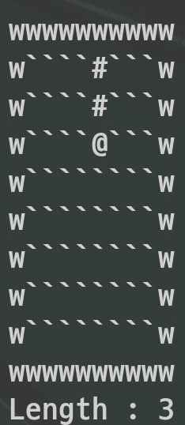
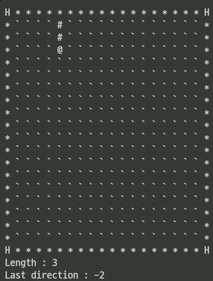
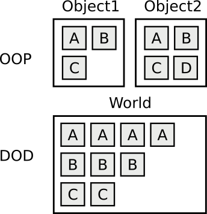

# 국민대학교 C++ 프로그래밍 기말 프로젝트


## 클래스 참조  
[Doxygen](https://kookminSnake.duckdns.org/)


## 소개

### 참여인 
- 20150803 사법학과 육심현
- 20191587 소프트웨어융합학과 류희재

### 맡은 역할

육심현
- 플레이어 시스템, 충돌 시스템, 아이템 시스템, 게이트 시스템, 파일 매니저 

류희재
- 사용자 입력, 점수판, 렌더러, 게임 매니저

### 작업 환경
- POP\_OS 20.04 (Ubuntu 기반)
- Fedora 31
- Ubuntu Virtual machine 

### 빌드방법

```
// 현재 Ubuntu 18.04, Ubuntu 20.04, Fedora 31에서만 컴파일 확인
// Ubuntu 18.04
// 의존성 파일 설치 후 컴파일
sudo add-apt-repository universe
sudo apt-get update
sudo apt-get install -y libncurses5-dev libncursesw5-dev libyaml-cpp-dev libyaml-cpp0.5v5
make no_dep

// Ubuntu 20.04
// 의존성 파일 설치 후 컴파일
sudo apt-get install -y libncurses5-dev libncursesw5-dev libyaml-cpp-dev libyaml-cpp0.6
make no_dep

// 의존성 파일 설치 없이 할 경우 
make 

// 클론하여 설치 
git clone https://github.com/Simhyeon/kookminSnake
cd kookminSnake
make
```

## 참고 이미지

- 단순히 움직이는 것(temporary 브랜치)

 

- 아이템을 먹는 것(temporary 브랜치)



- 게이트를 타고 이동하는 것(temporary 브랜치)




## 프로젝트 내용

### 기본 로직

중간 보고서 참조 : [중간보고서](https://kookminSnake.duckdns.org/ref/cpp_mid_report.pdf)

#### 데이터 지향 디자인
- 런타임 오버헤드를 최소화
- 데이터 집약적 설계
- Struct of array 가 아닌 array of Struct 구조를 채용
- 가급적 O(1) (constant) 시간으로 데이터에 접근하도록 하게 설계



#### Entity Component System 디자인 (ECS)
- 데이터 지향 디자인의 대표적인 구현 방법
- Component는 데이터만을 담는 오브젝트
- Entity는 Component cluster를 참조할 수 있게 하는 label 또는 ID
- System은 Component에 로직을 실행하는 일종의 task manager

#### ECS 개요


### 문서화

#### 사용한 툴 : doxygen

#### 문서화 서식: javadoc 
