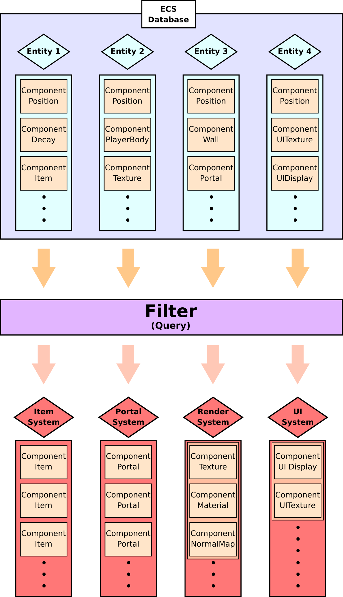

# 국민대학교 C++ 프로그래밍 기말 프로젝트


## 소개

### 참여인 
- 20150803 사법학과 육심현
- 20191587          류희재

### 맡은 역할

육심현
- 플레이어, 벽, 아이템, 물리 

류희재
- 사용자 입력, 점수판, 렌더러, 게임 매니저

### 작업 환경
- POP\_OS 20.04 (Ubuntu 기반)
- ...
- CI : Ubuntu 가상 머신 + ncurses 라이브러리

### 빌드방법

```
// 의존 라이브러리 설치 필요
sudo apt-get install -y libncurses5-dev libncursesw5-dev
// clone 또는 tarball 이용
git clone https://github.com/Simhyeon/kookminSnake
cd kookminSnake
make
```

## 프로젝트 내용

### 기본 로직

#### 데이터 지향 디자인
- 런타임 오버헤드를 최소화
- 데이터 집약적 설계
- Struct of array 가 아닌 array of Struct 구조를 채용
- 가급적 O(1) (constant) 시간으로 데이터에 접근하도록 하게 설계

#### Entity Component System 디자인 (ECS)
- 데이터 지향 디자인의 대표적인 구현 방법
- Component는 데이터만을 담는 오브젝트
- Entity는 Component cluster를 참조할 수 있게 하는 label 또는 ID
- System은 Component에 로직을 실행하는 일종의 task manager

#### ECS 개요


#### 프로젝트에서 ECS의 구현방법
- blahblahblah
- blahblahblah
- blahblahblah

### 문서화

#### 사용한 툴 : doxygen

#### 문서화 서식: javadoc 
